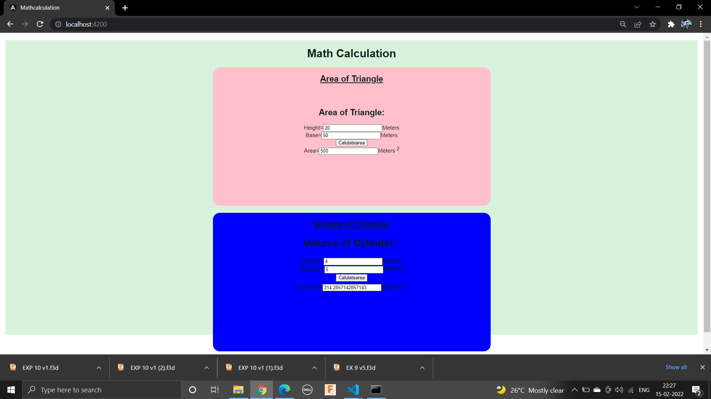
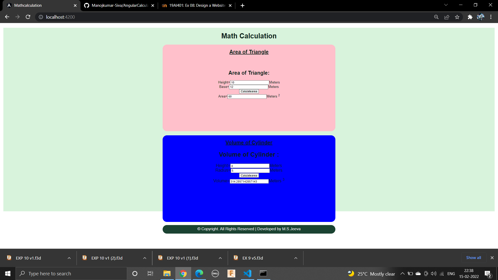

# AngularCalculation

# Web Page for Mathematical Calculations using Angular

## AIM:
To design a dynamic website to perform mathematical calculations using Angular Framwork

## DESIGN STEPS:

### Step 1:

Requirement collection.

### Step 2:

Creating the layout using HTML and CSS in component.html file

### Step 3:

Write typescript to perform the calculations.

### Step 4:

Validate the layout in various browsers.

### Step 5:

Validate the HTML code.

### Step 6:

Publish the website in the given URL.

## PROGRAM :
```

## Cylinder.component.html:
<div>
    <h2>Volume of Cylinder :</h2>
    Height=<input type="text"[(ngModel)]="height">Meters<br/>    
    Radius=<input type="text"[(ngModel)]="radius">Meters<br/>
    <input type="button" (click)="onCalculate()" value="Calulatearea"><br/>
    Volume=<input type="text"[value]="volume" readonly>Meters <sup>3</sup>
    
</div>

## Cylinder.component.ts:

import { Component } from "@angular/core";

@Component({
    selector:'vol-cylinder',
    templateUrl:'./cylinder.component.html',

})
export class CylinderComponent{
    height:number;
    radius:number;
    volume:number;
    constructor(){
        this.height=4
        this.radius=5
        this.volume=(this.height*this.radius**2*22/7)

    }
    onCalculate(){
        this.volume=(this.height*this.radius**2*22/7)
    }
}

## app.component.html:

<body>
    <div class="container">
    <h1>Math Calculation</h1>
    <div class="content">
        <h2 class="padding"><u>Area of Triangle</u></h2>
        <Tri-Area class="forms, padding" ></Tri-Area>
    </div>
    <div class="content1">
        <h2><u>Volume of Cylinder</u></h2>
        <vol-cylinder class="forms"></vol-cylinder>
    </div>
    <div class="footer">
      &copy; Copyright. All Rights Reserved | Developed by M.S.Jeeva
    </div>
    </div>
  
  </body>

  ## Style.css:

  *{
    box-sizing: border-box;
    font-family: Arial, Helvetica, sans-serif;
    }
    
    body{
        background-color: #d8f3dc;
        color: #081c15;
    }
    
    .container{
        text-align: center;
        width: 1080px;
        height: 850px;
        margin-left: auto;
        margin-right: auto;
        margin-top: auto;
    }
    
    .content{
        display: block;
        width: 100%;
        margin-left: auto;
        margin-right: auto;
        background-color: pink;
        height: 400px;
        width: 800px;
        text-align: center;
        border-radius: 20px;
    }
    
    .padding{
        padding-bottom: 50px;
    }
    .content1{
        display: block;
        width: 100%;
        margin-left: auto;
        margin-right: auto;
        background-color:blue;
        margin-top: 15px;
        height: 400px;
        width: 800px;
        border-radius: 20px;
    }
    
    h1{
        color: #081c15;
        text-align: center;
        padding-top: 20px;
    }
    
    h2{
        color: #081c15;
        text-align: center;
        padding-top: 20px;
    }
    a{
        padding-left: 1pc;
    }
    input{
        border-radius: 20px;
        text-align: center;
        box-shadow: 1.5px 7px #081c15;
        background-color: #428ae6;
    }

    .forms{
        text-align: center;
        padding-top: 20px;
        font-size: larger;
    }
    
    .button{
        background-color: #d8f3dc;
        border: 1px solid;
        padding: 5px;
        box-shadow: 1.5px 7px #1b4332;
    }
    
    
    .footer{
        color: whitesmoke;
        margin-top: 15px;
        display: inline-block;
        height: 40px;
        width: 800px;
        background-color: #1b4332; 
        text-align: center;
        padding-top: 7px;
        font-size: large;
        border-radius: 20px;
    }
    

## triangle.component.html:
<div>
    <h2>Area of Triangle:</h2>
    Height=<input type="text"[(ngModel)]="height">Meters<br/>    
    Base=<input type="text"[(ngModel)]="base">Meters<br/>
    <input type="button" (click)="onCalculate()" value="Calulatearea"><br/>
    Area=<input type="text"[value]="area" readonly>Meters <sup>2</sup>
    
</div>

## triangle.component.ts:

import { Component } from "@angular/core";

@Component({
    selector:'Tri-Area',
    templateUrl:'./triangle.component.html',
   

})
export class TriangleComponent{
    height:number;
    base:number;
    area:number;
    constructor(){
        this.height=20
        this.base=50
        this.area=(this.height*this.base)/2


    }
    onCalculate(){
        this.area=(this.height*this.base)/2
    }

                }

```
## OUTPUT:




## Result:
A dynamic website to perform mathematical calculations is designed using Angular Framwork.